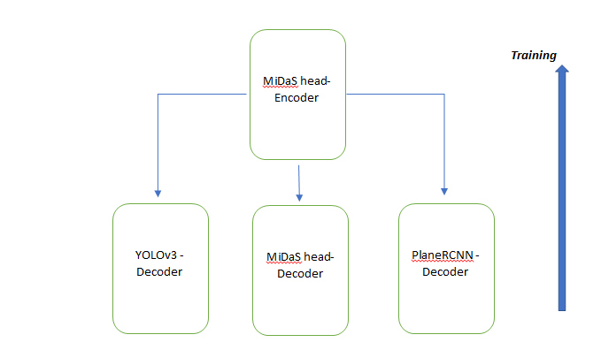

# A Combination approach for object detection with depth prediction and image segmentation

 ## Model Creation 
   Objective – Requirement suggested that we have to unify three different vision models and train as one unified model

### Model architecture:

  a. Use YOLO architecture to identify specific classes(Hardhat, Vest, Mask, Boots)
  
  b. Use MiDAS architecture to generate depth map on custom images
  
  c. Use PlaneRCNN architecture to generate plane maps and furthe create segmentation on custom images

Entire backbone of this project is based on the concepts of transfer learning where pretrained model weights are being used to fine tune the weights based on the custom data created from sample images.

### MiDAS – reference: https://github.com/intel-isl/MiDaS

MiDaS architecture is used as a backbone for the entire trio model architecture. The ResNext101 part of this model is used as is as encoder structure to learn on the image features maps. The MiDAS part serving as an encoder generating the required feature maps which were passed onto the decoder part formed by MiDaS(for MiDaS) , YOLOv3(for YOLOv3) and PlaneRCNN.

### YOLOV3 – reference: https://github.com/ultralytics/yolov3

YOLOv3 architecture was trained on the already extracted feature maps from the MiDAS encoder. Some previous modification was done on the already created features from
ResNext101 to match YOLOv3 decoder requirements followed by decoder YOLO part.

### PlaneRCNN – reference: https://github.com/NVlabs/planercnn

The prime purpose of PlaneRCNN was to generates planes from an image, detects arbitrary number of planes, and reconstructs piecewise planar surfaces from a single RGB image. The feature maps from the ResNext101 is followed into PlaneRCNN block matching up with the encoder output shapes to input of the decoder (PlaneRCNN). We are not uwing the depth portion of PlaneRCNN as this was consumend from MiDAS.  

 

## Dataset Creation

As we have already gone through the model, which is a combination of MiDAS, Yolo and PlaneRCNN we have created our own dataset from all three submodels - MiDAS, YoloV3 and PlaneRCNN, which further combined to create the master data.  Manually collected and annotated data of ~3500 images was used as the initial start point. 

### Create MiDAS Dataset:

Original MiDas github repo (https://github.com/intel-isl/MiDaS) was used to create the MiDAS dataset ground truth. We ran our data on the pretrained MiDas weights and generated the depth maps of all the input images. 

### Create YoloV3 Dataset:

In the case of Yolo we use the annotated labels created during previous assignments. In time to training we have used pretrained YoloV3 weights.

### Create PlaneRCNN Dataset:

In the case of PlaneRCNN, we are using segmentation and Masks output after validating on pretrained weight. We are not using the depth output as MiDAS does better depth predictions. The masks and segmentations of the output then combined to get a 2D image.

### Folder Structure Creation: 
 
 ```
 data
├── images/
├── midas
│   ├── custom.data
│   └── depth
├── planercnn
│   ├── camera.txt
│   ├── custom.data
│   ├── masks
│   └── parameters
├── yolo
│   ├── custom.data
│   ├── custom.names
│   ├── images.shapes
│   ├── labels
│   ├── test.shapes
│   ├── test.txt
│   ├── train.shapes
│   └── train.txt

```

 1. The ```image``` folder contains all the original images
 
 2. the ```midas/depth``` folder contains all the depth images traind on MiDAS. The ```costom.data``` in midas folder structure the following:

 ```
 depth=./depth
images=../images
```

3. The ```planercnn/masks``` folder contains the plane segmentation images and the ```planercnn/parameters``` folder contains the plane parameters files. ```camera.txt``` is the same as the one used in the inference of vanilla PlaneRCNN. The ```planercnn/custom.data``` file is something like this:

```
masks=./masks
parameters=./parameters
images=../images
camera=./camera.txt
```

4. The ```yolo``` folder is structured the same way as mentioned in the YoloV3 repo (https://github.com/ultralytics/yolov3).

## Training the Model

Training is majorly done using transfer learning strategy. The reason being, the lack of the number of training images and processing power and this process provide satisfactory results in limited time. 
 
### MiDAS training

MiDAS was used as the backbone for training and the weights were frozen, only the loss calculation for MiDAS was implemented. Simple RMSE Loss was chosen. In the dataset, the input images were letterboxed, so before applying the loss function, the letterbox paddings were removed (using the padding extents that were returned by the dataset), output was resized to match the ground truth size and then the RMSE loss was applied.

```python
 # midas loss
        midas_loss = rmse_loss(
            midas_out, midas_data[-1], letterbox_borders=yolo_data[-1]
        )
        
  # yolo
        yolo_loss, _ = (
            self.yolo_trainer.post_train_step(
                yolo_out, yolo_data, batch_idx, self.current_epoch
            )
            if self.config.USE_YOLO
            else (0, 0)
        )
```

### PlaneRCNN training

In the case of PlaneRCNN, issues encountered here were mostly related to depth and GPU vs CPU, but that was solved by disabling depth prediction in the PlaneRCNN config. Also did some code change to maintain and transfer the data to the correct device. The loss function used for PlaneRCNN is the same as what is used in vanilla PlaneRCNN.

```
# planercnn loss
        planercnn_loss = (
            torch.mean(
                torch.stack(
                    self.planercnn_trainer.train_step_on_batch(
                        planercnn_data, planercnn_out, device=self.device
                    ),
                    0,
                )
            )
            if self.config.USE_PLANERCNN
            else 0
        )
```
 
### Combine all

The final loss was computed as a weighted sum of all the three individual losses. While training it has been observed that PlaneRCNN cannot be trained with a batch size of more than 1. So the entire training process was conducted using batch size of 1. This took a lot of training time on Colab GPU. For training on more than batch size one, from my understanding it can be trained as a part training (train YOLO then PlaneRCNN). 

``` python
       #Total loss
       
        loss = (
            self.config.MIDAS_LOSS_WEIGHT * midas_loss
            + self.config.YOLO_LOSS_WEIGHT * yolo_loss
            + self.config.PLANERCNN_LOSS_WEIGHT * planercnn_loss
        )
```

## Model Evaluation

Yolo validated output:

 

MiDAS validated output:

 
